# Portfolio Cover Gallery

A static HTML portfolio gallery that collects nine standalone front-end projects into one cover page. The root `index.html` works as the portfolio entry point, with separate links for viewing each live page and opening its source file.

Live site: <https://phakinza007.github.io/my-portfolio/>

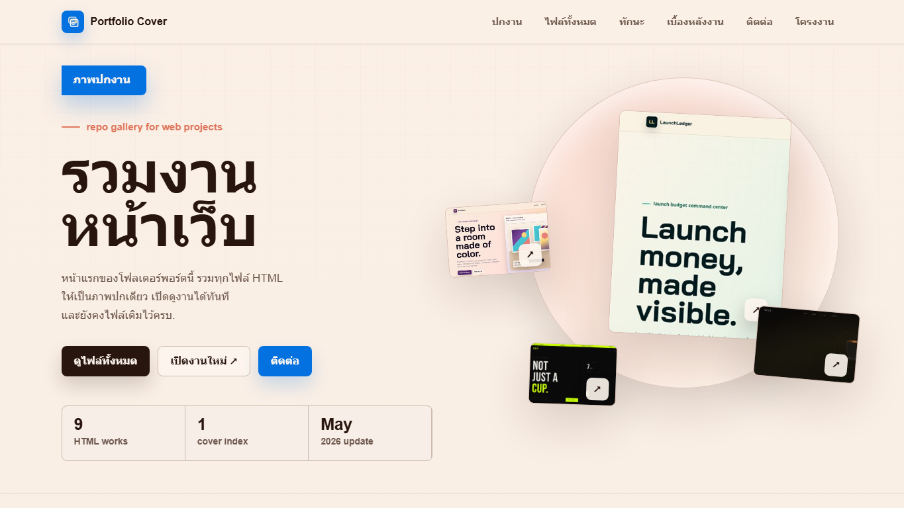
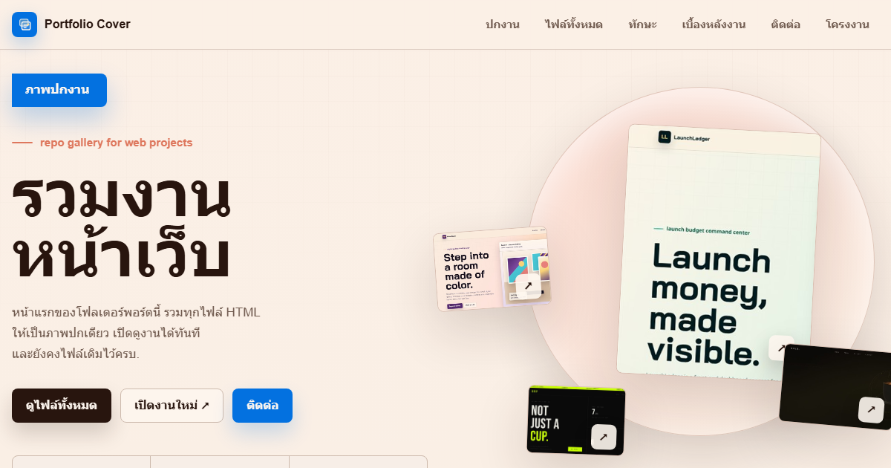

## Projects

| Project | Live page | Source file | Preview |
| --- | --- | --- | --- |
| LaunchLedger | [Open live](https://phakinza007.github.io/my-portfolio/LaunchLedger.html) | [`LaunchLedger.html`](https://github.com/Phakinza007/my-portfolio/blob/main/LaunchLedger.html) | 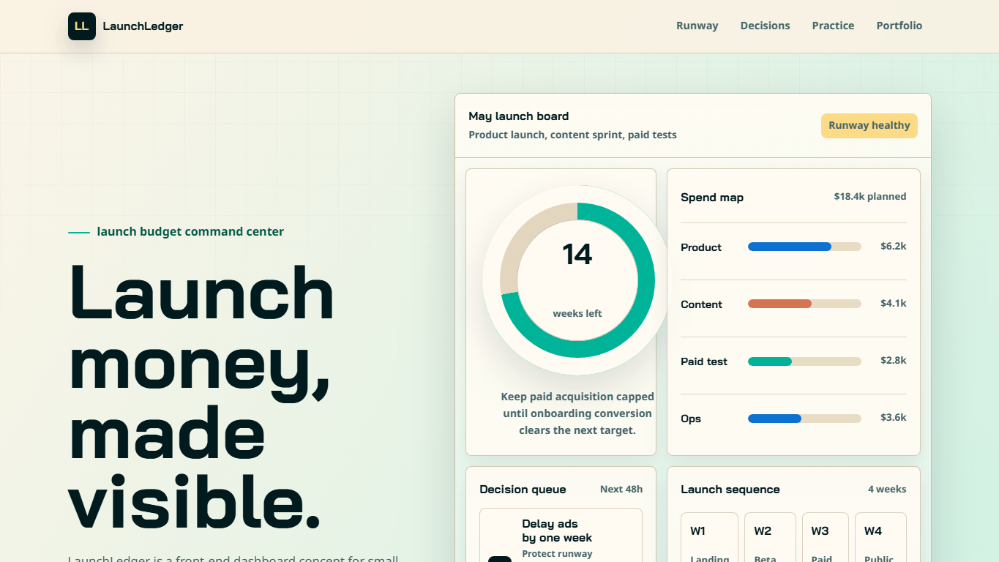 |
| MuseRoom | [Open live](https://phakinza007.github.io/my-portfolio/MuseRoom.html) | [`MuseRoom.html`](https://github.com/Phakinza007/my-portfolio/blob/main/MuseRoom.html) | 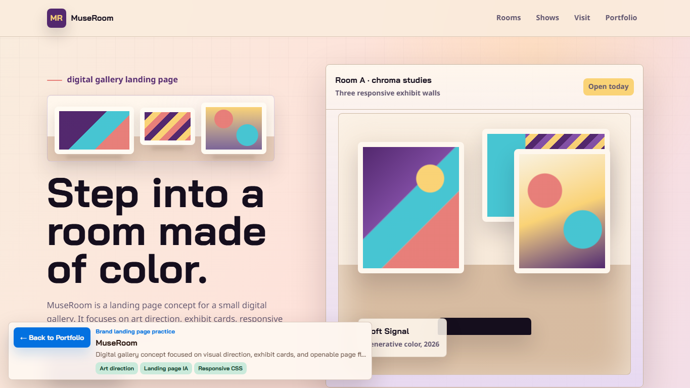 |
| InternTrack | [Open live](https://phakinza007.github.io/my-portfolio/InternTrack.html) | [`InternTrack.html`](https://github.com/Phakinza007/my-portfolio/blob/main/InternTrack.html) | 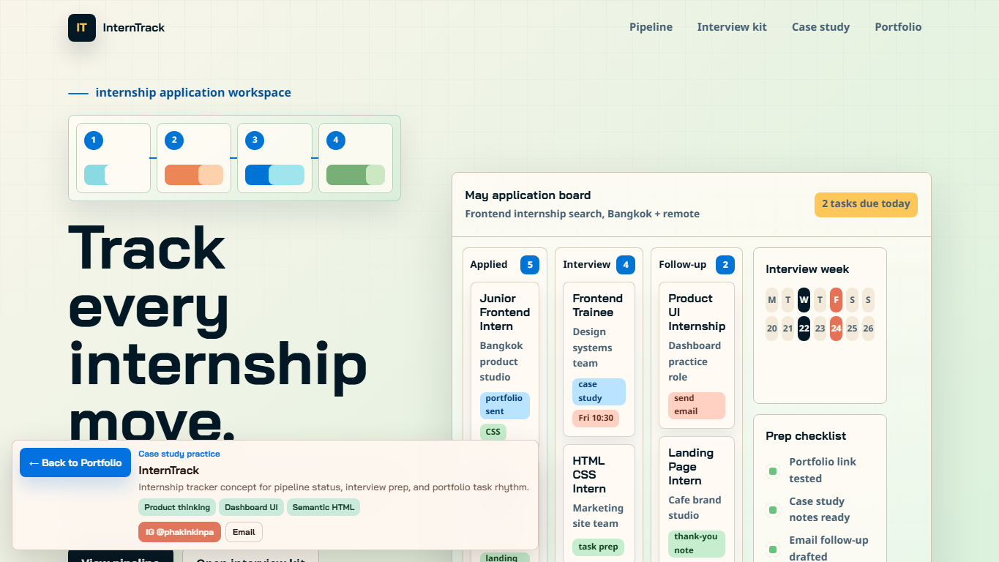 |
| PulseBoard | [Open live](https://phakinza007.github.io/my-portfolio/PulseBoard.html) | [`PulseBoard.html`](https://github.com/Phakinza007/my-portfolio/blob/main/PulseBoard.html) | 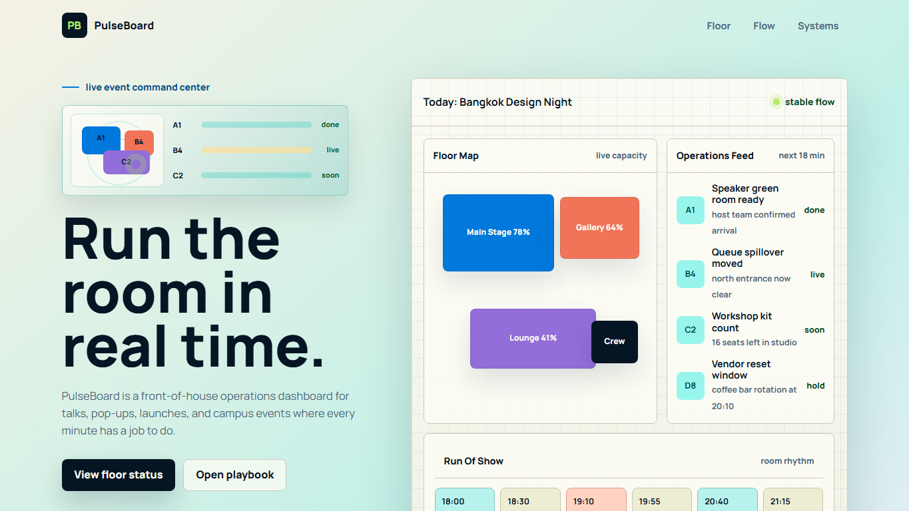 |
| DevLaunch Academy | [Open live](https://phakinza007.github.io/my-portfolio/intern_landing_page_html_css.html) | [`intern_landing_page_html_css.html`](https://github.com/Phakinza007/my-portfolio/blob/main/intern_landing_page_html_css.html) | 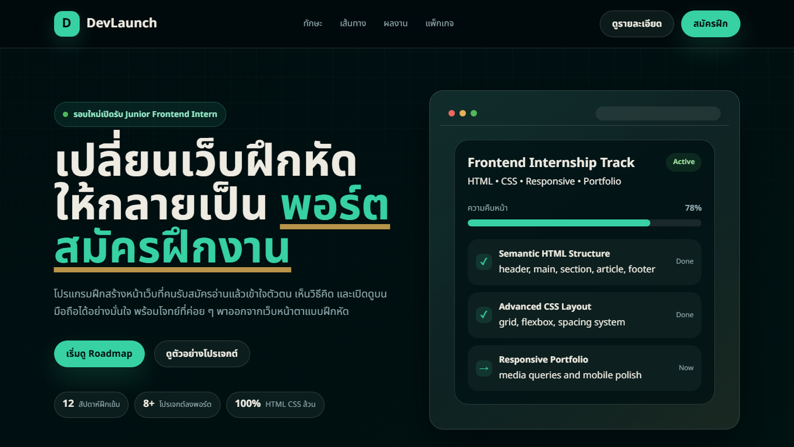 |
| Brew & Co. | [Open live](https://phakinza007.github.io/my-portfolio/Brew%20%26%20Co..html) | [`Brew & Co..html`](https://github.com/Phakinza007/my-portfolio/blob/main/Brew%20%26%20Co..html) | 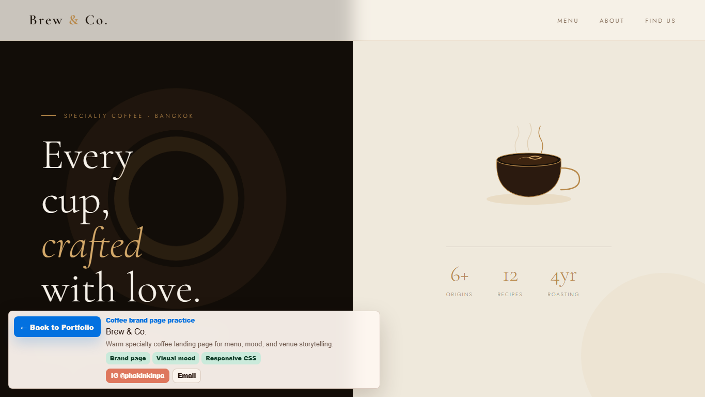 |
| NOIR Coffee | [Open live](https://phakinza007.github.io/my-portfolio/coffee-landing.html) | [`coffee-landing.html`](https://github.com/Phakinza007/my-portfolio/blob/main/coffee-landing.html) | 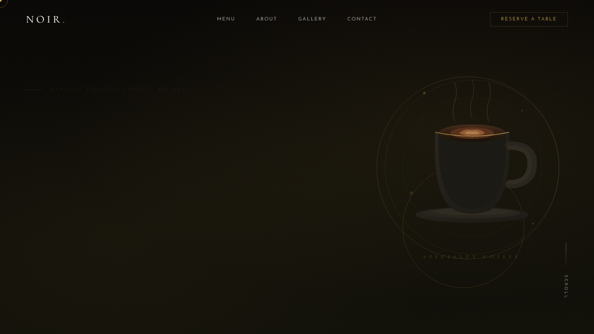 |
| DRIP Coffee Bar | [Open live](https://phakinza007.github.io/my-portfolio/DRIP.html) | [`DRIP.html`](https://github.com/Phakinza007/my-portfolio/blob/main/DRIP.html) | 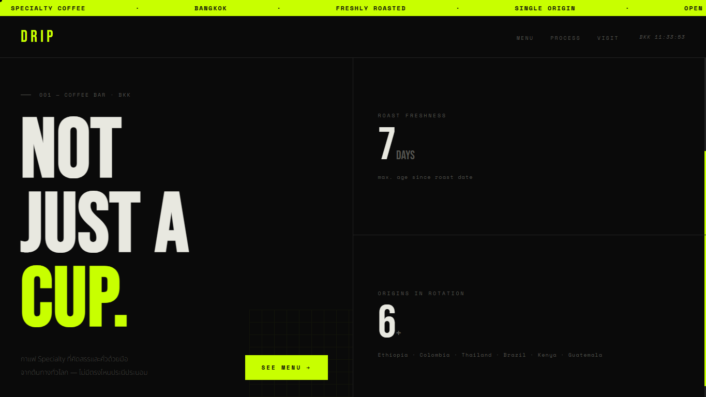 |
| Cozy Coffee Shop | [Open live](https://phakinza007.github.io/my-portfolio/coffee_shop_landing_page.html) | [`coffee_shop_landing_page.html`](https://github.com/Phakinza007/my-portfolio/blob/main/coffee_shop_landing_page.html) | 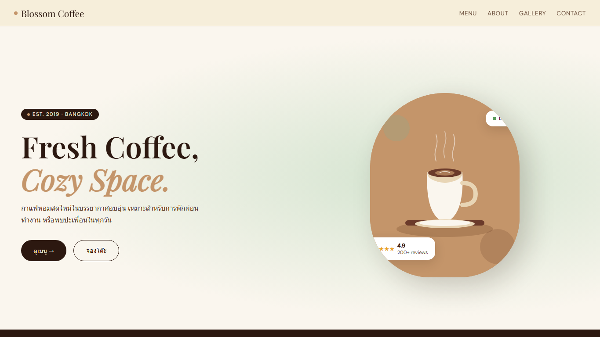 |

## Case Studies

The homepage includes compact case-study notes for InternTrack, PulseBoard, and DevLaunch Academy. Each one explains the challenge, three design decisions, practiced skills, and links to both the live page and source file.

The homepage also includes an About / Skills band, project status badges, and a stronger contact CTA so reviewers can understand the portfolio without copying links or searching through files.

## How To Open

### Open directly

Open `index.html` in a browser.

### Run locally

From this folder:

```bash
python -m http.server 4173 --bind 127.0.0.1
```

Then visit:

```text
http://127.0.0.1:4173/index.html
```

## GitHub Pages

This repository is deployed from the `main` branch and root folder:

```text
https://phakinza007.github.io/my-portfolio/
```

The launch setup includes SEO metadata, Open Graph/Twitter preview tags, a custom favicon, a web manifest, and a GitHub Pages `404.html` fallback.

## Contact

Phakin Chawanpunya

- GitHub: <https://github.com/Phakinza007>
- Email: <a0626568471@gmail.com>

## Structure

```text
.
├── index.html
├── 404.html
├── site.webmanifest
├── LaunchLedger.html
├── MuseRoom.html
├── InternTrack.html
├── PulseBoard.html
├── intern_landing_page_html_css.html
├── Brew & Co..html
├── coffee-landing.html
├── DRIP.html
├── coffee_shop_landing_page.html
└── assets/
    ├── favicon.svg
    ├── social-preview.png
    ├── screenshots/
    └── thumbs/
```
