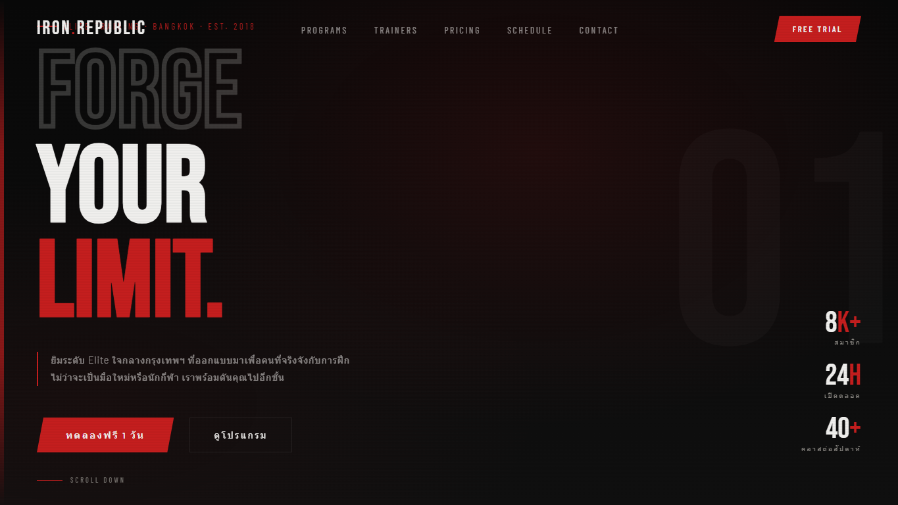

# Portfolio Cover Gallery

A static HTML portfolio gallery that collects ten standalone front-end projects into one cover page. The root `index.html` works as the portfolio entry point, with separate links for viewing each live page and opening its source file.

Live site: <https://phakinza007.github.io/my-portfolio/>


## Projects

| Project | Live page | Source file | Preview |
| --- | --- | --- | --- |
| LaunchLedger | [Open live](https://phakinza007.github.io/my-portfolio/LaunchLedger.html) | [`LaunchLedger.html`](https://github.com/Phakinza007/my-portfolio/blob/main/LaunchLedger.html) |  |
| MuseRoom | [Open live](https://phakinza007.github.io/my-portfolio/MuseRoom.html) | [`MuseRoom.html`](https://github.com/Phakinza007/my-portfolio/blob/main/MuseRoom.html) |  |
| InternTrack | [Open live](https://phakinza007.github.io/my-portfolio/InternTrack.html) | [`InternTrack.html`](https://github.com/Phakinza007/my-portfolio/blob/main/InternTrack.html) |  |
| PulseBoard | [Open live](https://phakinza007.github.io/my-portfolio/PulseBoard.html) | [`PulseBoard.html`](https://github.com/Phakinza007/my-portfolio/blob/main/PulseBoard.html) |  |
| DevLaunch Academy | [Open live](https://phakinza007.github.io/my-portfolio/intern_landing_page_html_css.html) | [`intern_landing_page_html_css.html`](https://github.com/Phakinza007/my-portfolio/blob/main/intern_landing_page_html_css.html) |  |
| Iron Republic | [Open live](https://phakinza007.github.io/my-portfolio/gym-landing.html) | [`gym-landing.html`](https://github.com/Phakinza007/my-portfolio/blob/main/gym-landing.html) |  |
| Brew & Co. | [Open live](https://phakinza007.github.io/my-portfolio/Brew%20%26%20Co..html) | [`Brew & Co..html`](https://github.com/Phakinza007/my-portfolio/blob/main/Brew%20%26%20Co..html) |  |
| NOIR Coffee | [Open live](https://phakinza007.github.io/my-portfolio/coffee-landing.html) | [`coffee-landing.html`](https://github.com/Phakinza007/my-portfolio/blob/main/coffee-landing.html) |  |
| DRIP Coffee Bar | [Open live](https://phakinza007.github.io/my-portfolio/DRIP.html) | [`DRIP.html`](https://github.com/Phakinza007/my-portfolio/blob/main/DRIP.html) |  |
| Cozy Coffee Shop | [Open live](https://phakinza007.github.io/my-portfolio/coffee_shop_landing_page.html) | [`coffee_shop_landing_page.html`](https://github.com/Phakinza007/my-portfolio/blob/main/coffee_shop_landing_page.html) |  |

## Resume and Case Studies

The portfolio includes a public resume page and downloadable PDF:

- Resume page: <https://phakinza007.github.io/my-portfolio/resume.html>
- Resume PDF: [`assets/resume-phakin-chawanpunya.pdf`](assets/resume-phakin-chawanpunya.pdf)

Three full case study pages explain the thinking behind the strongest reviewer examples:

- InternTrack: <https://phakinza007.github.io/my-portfolio/case-study-interntrack.html>
- LaunchLedger: <https://phakinza007.github.io/my-portfolio/case-study-launchledger.html>
- PulseBoard: <https://phakinza007.github.io/my-portfolio/case-study-pulseboard.html>

The homepage also includes compact case-study notes for extra project range, an About / Skills band, project status badges, and a stronger contact CTA so reviewers can understand the portfolio without copying links or searching through files.

The hero includes a featured case-study link to InternTrack so reviewers can jump straight into a stronger product-thinking example, plus a Resume link in the top navigation.

Each standalone project page includes a fixed `Back to Portfolio` context panel, page-specific title metadata, a short project intro, and practiced-skill tags.

## How To Open

### Open directly

Open `index.html` in a browser.

### Run locally

From this folder:

```bash
python -m http.server 4173 --bind 127.0.0.1
```

Then visit:

```text
http://127.0.0.1:4173/index.html
```

## GitHub Pages

This repository is deployed from the `main` branch and root folder:

```text
https://phakinza007.github.io/my-portfolio/
```

The launch setup includes SEO metadata, Open Graph/Twitter preview tags, a custom favicon, a web manifest, and a GitHub Pages `404.html` fallback.

## Contact

Phakin Chawanpunya

- GitHub: <https://github.com/Phakinza007>
- Instagram: <https://www.instagram.com/phakinkinpa/>
- Email: <a0626568471@gmail.com>
- Resume page: <https://phakinza007.github.io/my-portfolio/resume.html>
- Resume PDF: [`assets/resume-phakin-chawanpunya.pdf`](assets/resume-phakin-chawanpunya.pdf)
- Resume notes: [`RESUME.md`](RESUME.md)

## Structure

```text
.
├── index.html
├── 404.html
├── resume.html
├── case-study-interntrack.html
├── case-study-launchledger.html
├── case-study-pulseboard.html
├── site.webmanifest
├── LaunchLedger.html
├── MuseRoom.html
├── InternTrack.html
├── PulseBoard.html
├── intern_landing_page_html_css.html
├── gym-landing.html
├── Brew & Co..html
├── coffee-landing.html
├── DRIP.html
├── coffee_shop_landing_page.html
└── assets/
    ├── favicon.svg
    ├── resume-phakin-chawanpunya.pdf
    ├── social-preview.png
    ├── screenshots/
    └── thumbs/
```
